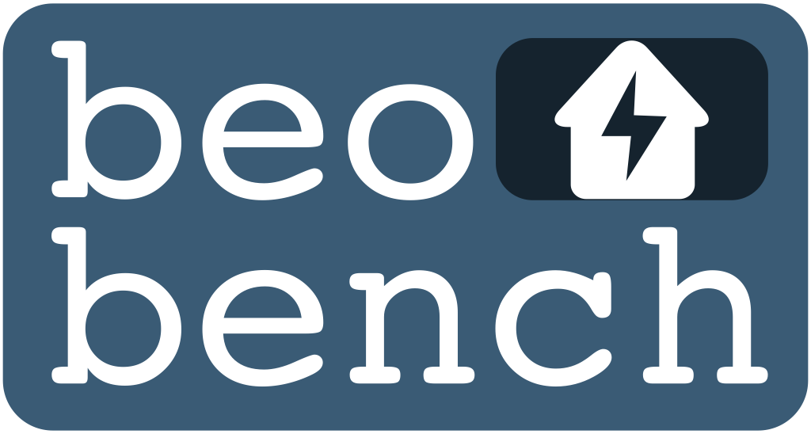

.. raw:: html

   

.. raw:: html

   

.. start-in-sphinx-docs

.. image:: https://img.shields.io/pypi/v/beobench.svg
        :target: https://pypi.python.org/pypi/beobench

.. image:: https://readthedocs.org/projects/beobench/badge/?version=latest
        :target: https://beobench.readthedocs.io/en/latest/?version=latest
        :alt: Documentation Status

.. image:: https://img.shields.io/badge/License-MIT-blue.svg
        :target: https://opensource.org/licenses/MIT
        :alt: License

A toolbox for benchmarking reinforcement learning (RL) algorithms on building energy optimisation (BEO) problems. Beobench tries to make working on RL for BEO easier: it provides simple access to existing libraries defining BEO problems (such as `BOPTEST <https://github.com/ibpsa/project1-boptest>`_) and provides a large set of pre-configured RL algorithms. Beobench is *not* a gym library itself - instead it leverages the brilliant work done by many existing gym-type projects and makes their work more easily accessible.

Features
--------

*Some of the features are work in progress*

**Main features**

- *RL algorithm collection:* what's the best RL method for your BEO problem? Building on `Ray RLlib <https://github.com/ray-project/ray/tree/master/rllib>`_, beobench provides a large collection of pre-configured RL algorithm experiments that can be easily applied to your new BEO problem.
- *Problem collection:* beobench provides ready-to-use docker containers for popular BEO gym-type problem libraries. By enforcing a strict OpenAI ``gym.Env`` it makes testing your method on different libraries easy.

**Additional features**

- *Experiment logging:* log experiment results in a reproducible and shareable manner via `Weights and Biases`_.
- *Hyperparameter tuning:* easily tune hyperparameters using the extensive `Ray Tune Search API <https://docs.ray.io/en/master/tune/index.html>`_.
- *Simple installation:* beobench can be installed via pip and only requires docker as an additional non-python dependency.
- *Easily extendable:* beobench is designed for the user to add both environments and methods.

.. _Weights and Biases: https://wandb.ai/

.. end-in-sphinx-docs

.. start-quickstart

Quickstart
----------

Run your first beobench experiment in three steps:

1. `Install docker <https://docs.docker.com/get-docker/>`_ on your machine (if on Linux, check the `additional installation steps <https://beobench.readthedocs.io/en/latest/guides/installation_linux.html>`_)
2. Install *beobench* using:

        .. code-block:: console

                pip install beobench
                
3. Finally, start your first experiment using:

        .. code-block:: console

                python -m beobench.experiment.scheduler

Done, you have just started your first experiment... congrats! Check out the `full getting started guide in the documentation <https://beobench.readthedocs.io/en/latest/guides/getting_started.html>`_ for the next steps.

.. end-quickstart

Documentation
-------------
https://beobench.readthedocs.io

License
-------
MIT license

Credits
-------

This package was originally created with Cookiecutter_ and the `audreyr/cookiecutter-pypackage`_ project template.

.. _Cookiecutter: https://github.com/audreyr/cookiecutter
.. _`audreyr/cookiecutter-pypackage`: https://github.com/audreyr/cookiecutter-pypackage
