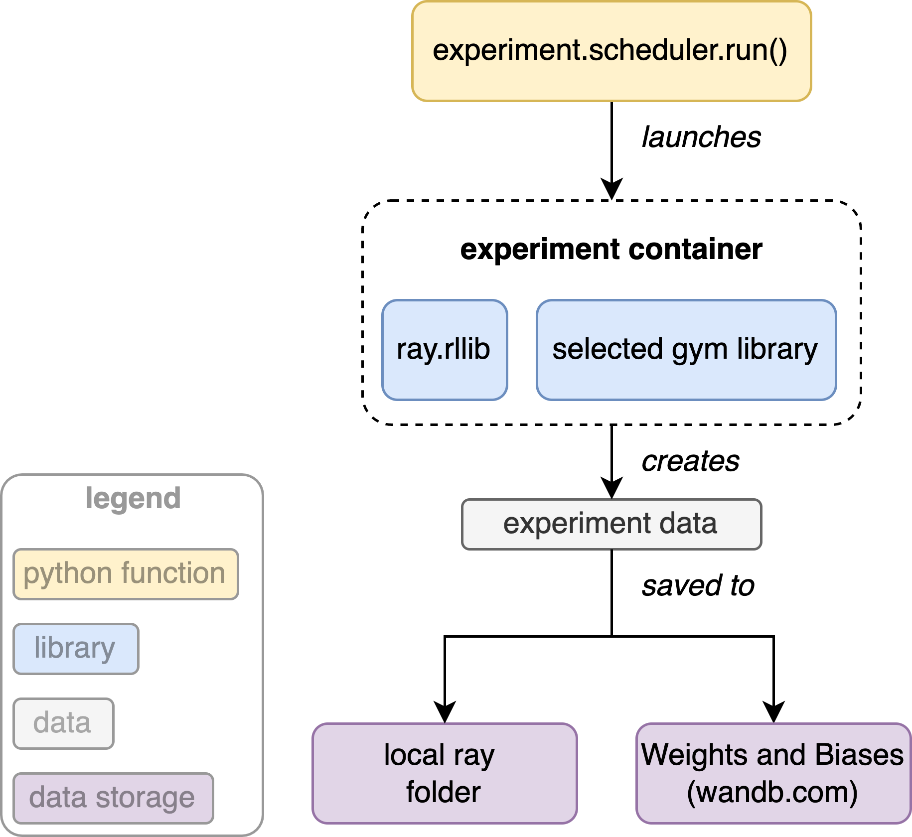

Creating new experiments
------------------------

Overview
^^^^^^^^

The diagram below gives an overview of how beobench experiments work. The ``beobench.experiment.scheduler.run()`` function builds and starts an *experiment container*. Within this container all experiments are being run using the *Ray RLlib* and *Ray Tune* libraries. Results are saved to a local folder (by default ``./beobench_results``), and optionally to Weights and Biases (wandb) as well.

Experiment configuration
^^^^^^^^^^^^^^^^^^^^^^^^^

Beobench defines experiments using three separate dictionaries for problem, method and machine configuration. Each defines the parameters relevant to one of these configurations. Internally, beobench then merges these three dictionaries into a single dictionary that is passed to the ``ray.tune.run()`` function. A beobench configuration file is a ``.py`` file that defines the variables ``problem``, ``method`` and ``rllib_setup``. For example, let the following be the content of a file named ``example_experiment_def.py``:

.. include:: ../../beobench/experiment/definitions/default.py
    :start-line: 2
    :code: python

Given this configuration file ``example_experiment_def.py``, we can the experiment using the following commands:

.. include:: ../snippets/run_standard_experiment.rst

Hyperparameter Search Spaces
^^^^^^^^^^^^^^^^^^^^^^^^^^^^

So far, we only configured a single experiment. However, we likely want to test multiple experiment configurations. As beobench builds on *Ray RLlib* and *Ray Tune*, we can use the powerful `Ray Tune Search Space API <https://docs.ray.io/en/master/tune/api_docs/search_space.html>`_. This API allows us to configure pretty much any hyperparameter search space. For example to do grid search on the learning rate, we can replace the following line in the previously shown ``example_experiment_def.py``

.. code-block:: python

    "lr": 5e-3,

with

.. code-block:: python

    "lr": ray.tune.grid_search([5e-3, 5e-4, 5e-5]),

Beobench will then run three experiments trying three different values of the learning rate (``lr``). Note that ``import ray.tune`` must also be included in ``example_experiment_def.py``. In addition to simple grid search, it is also possible to use *Ray Tune's* `Random Distribution API <https://docs.ray.io/en/master/tune/api_docs/search_space.html#random-distributions-api>`_. This allows us to create probabilistic hyperparameter search spaces, that we can either randomly sample or apply optimisation algorithms to. See the `Ray Tune Search Space API documentation <https://docs.ray.io/en/master/tune/api_docs/search_space.html>`_ for a more complete description of the functionality.