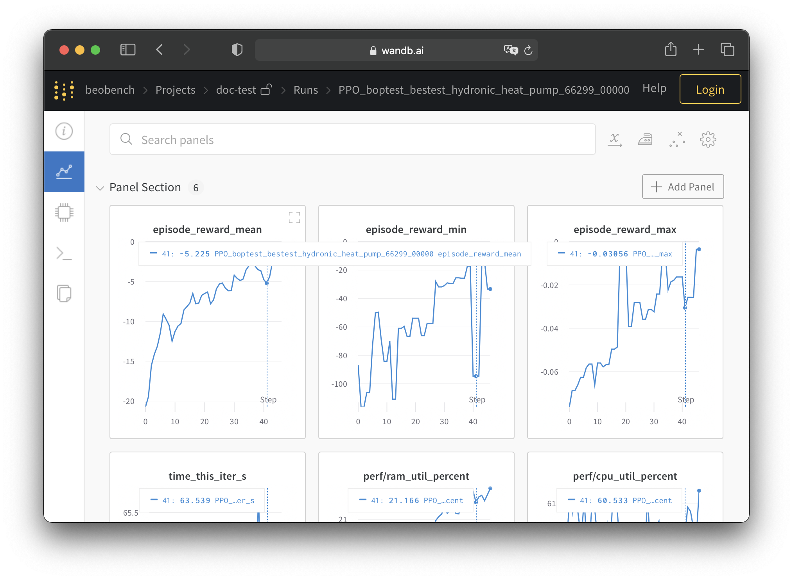

Quickstart
----------

Run first experiment
^^^^^^^^^^^^^^^^^^^^^^

Let's run your first experiment with beobench. After installing beobench using the :ref:`installation guide <sec-installation>`, you can simply use one of the following two commands to run a first experiment:

.. tabs::

    .. code-tab:: console Console

            python -m beobench.experiment.scheduler

    .. code-tab:: python

        import beobench.experiment.scheduler

        beobench.experiment.scheduler.run()

This will run the default experiment `defined here <beobench/experiment/definitions/default.py>`_: Proximal Policy Optimisation (PPO) applied a testcase in the BOPTEST library. The results of this experiment will be logged in a newly created ``./beobench_results`` directory.

Visualize experiment results
^^^^^^^^^^^^^^^^^^^^^^^^^^^^^^

Although the ``./beobench_results`` folder already contains a lot of information, it can be more helpful to log our experiment data to a proper experiment tracking service. Beobench provides an integration with the `Weights and Biases (wandb) <wandb.com>`_ cloud-based tracking service for this purpose. To use wandb we add the following arguments to the previous command:

.. tabs::

    .. code-tab:: console Console

            python -m beobench.experiment.scheduler \
                --wandb-project=<your_project_name> \
                --wandb-entity=<your_entity> \
                --wandb-api-key=<your_api_key>

    .. code-tab:: python

        import beobench.experiment.scheduler

        beobench.experiment.scheduler.run(
                wandb_project=<your_project_name>,
                wandb_entity=<your_entity>,
                wandb_api_key=<your_api_key>
        )
where you replace ``<your_project_name>``, ``<your_entity>`` and ``<your_api_key>`` with your own wandb information. See `this guide <https://docs.wandb.ai/quickstart>`_ to get started with wandb. With this setup you will now be able to see the experiment progress on your wandb dashboard, similar to the one shown below. You can `find a live dashboard of another run of this experiment here <https://wandb.ai/beobench/doc-test/runs/66299_00000>`_.

.. _example wandb: https://wandb.ai/beobench/doc-test/runs/66299_00000